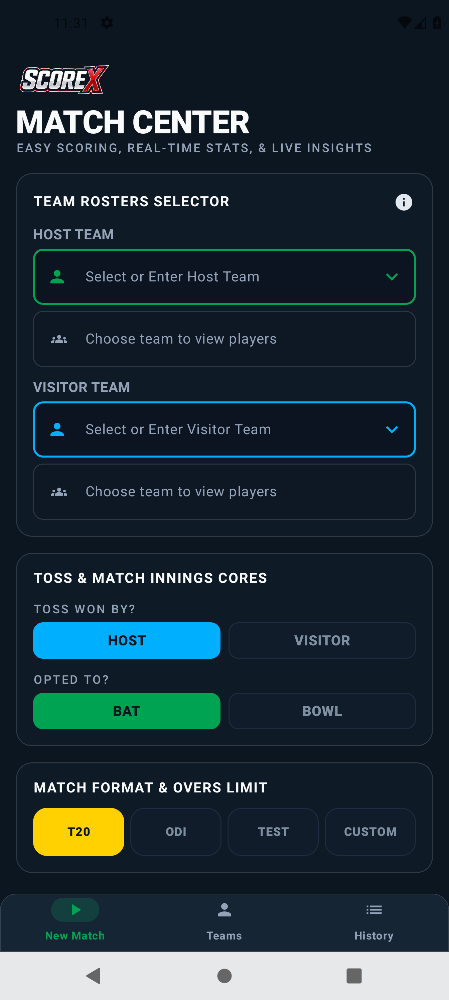
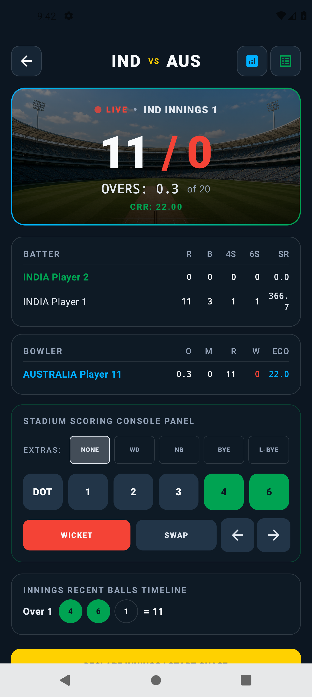
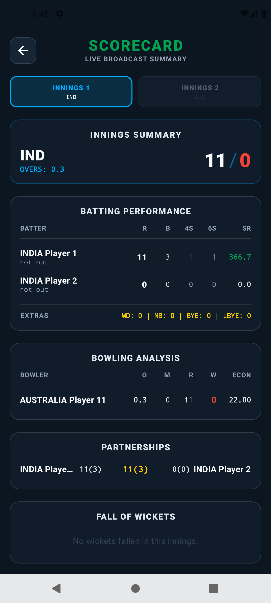
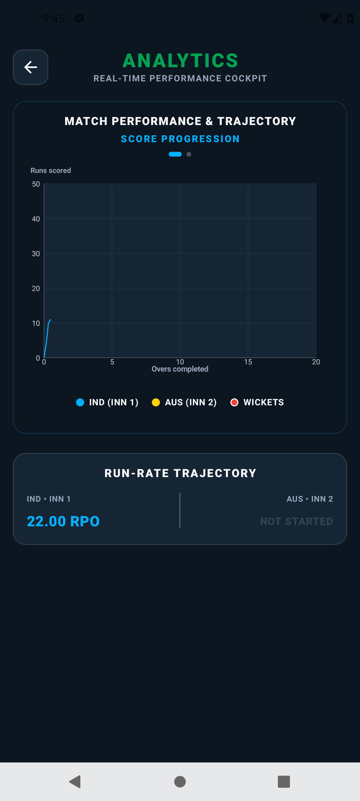
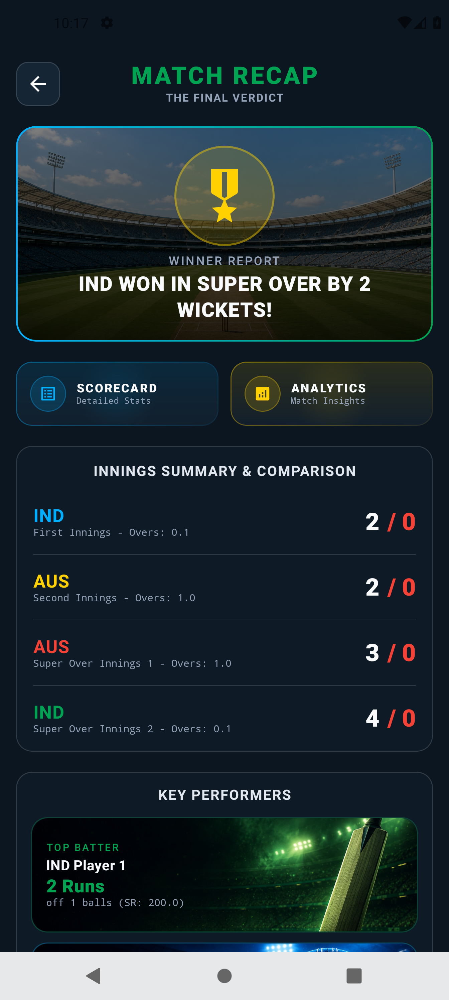

<p align="center">
  
</p>

# ScoreX Cricket Scorer

[](https://github.com/KhajaRaheelAhmedMohiuddin/scorex-cricket-scorer/actions/workflows/android-ci.yml)
[](LICENSE)


ScoreX is an offline Android cricket-scoring app built with Kotlin and Jetpack Compose. Record ball-by-ball scoring, extras, wickets, partnerships, scorecards, analytics, match history, and Super Overs without an account or network connection.

## Screenshots

<table>
  <tr>
    <td></td>
    <td></td>
    <td></td>
  </tr>
  <tr>
    <td align="center"><b>Match Center</b></td>
    <td align="center"><b>Live Scoring</b></td>
    <td align="center"><b>Scorecard</b></td>
  </tr>
  <tr>
    <td></td>
    <td></td>
    <td></td>
  </tr>
  <tr>
    <td align="center"><b>Analytics</b></td>
    <td align="center"><b>Super Over Recap</b></td>
    <td></td>
  </tr>
</table>

## Features

- Ball-by-ball scoring for runs, wides, no-balls, byes, leg byes, and wickets
- Live batting, bowling, extras, fall-of-wicket, partnership, and run-rate statistics
- Match setup with custom teams, player rosters, toss, and T20/ODI/Test/custom-over formats
- Match history stored locally with Room
- Scorecard, match-recap, and analytics screens
- Undo and redo support for the current innings
- Super Over scoring for tied matches

## Tech stack

- **Language:** Kotlin
- **UI:** Jetpack Compose (Material 3)
- **Architecture:** MVVM with `AndroidViewModel` and Kotlin `StateFlow`
- **Persistence:** Room (with Moshi for delivery serialization)
- **Build:** Gradle Kotlin DSL with a version catalog

## Requirements

- Android Studio with Android SDK Platform 36 installed
- JDK 17 or newer

## Build and test

The Gradle wrapper is included, so no system Gradle installation is required.

```bash
./gradlew assembleDebug        # build the debug APK
./gradlew testDebugUnitTest    # run the unit / Robolectric / Compose UI tests
./gradlew lintDebug            # static analysis
```

On Windows, use `gradlew.bat` instead of `./gradlew`. The debug APK is written to `app/build/outputs/apk/debug/app-debug.apk`.

The project ships with **63 automated tests** covering the scoring engine, the match-state ViewModel (via Robolectric), the Super Over flow, dismissals, and the dashboard UI. Every push and pull request is built and tested by [GitHub Actions](.github/workflows/android-ci.yml).

## Run

1. Open this folder in Android Studio.
2. Allow Gradle sync to finish.
3. Choose an Android emulator or connected device.
4. Run the `app` configuration.

## Privacy

ScoreX stores match data only on the device. It does not require an API key, account, or network permission.

## Release signing

Release builds are unsigned by default. Keep your keystore and signing credentials outside the repository, then sign the generated release artifact in Android Studio or your CI pipeline.

## Credits

- Typeface: [Manrope](https://github.com/sharanda/manrope) by Mikhail Sharanda, bundled under the [SIL Open Font License](docs/Manrope-OFL.txt).

## License

Released under the [MIT License](LICENSE).
